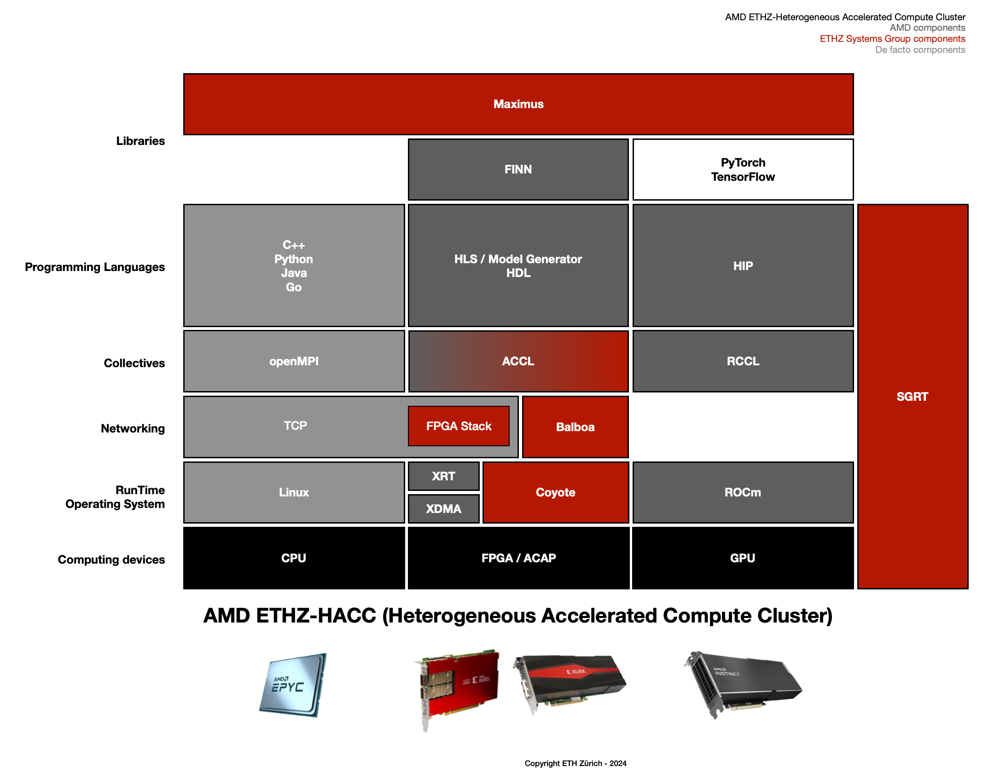

<!-- <div id="readme" class="Box-body readme blob js-code-block-container">
<article class="markdown-body entry-content p-3 p-md-6" itemprop="text"> -->
<p align="right">
<a href="https://github.com/fpgasystems">fpgasystems</a> <a href="https://github.com/fpgasystems/hacc">HACC</a> <a href="https://github.com/fpgasystems/sgrt">SGRT</a>
</p>

<p align="center">

</p>

<h1 align="center">
  Hardware ACCeleration Platform
</h1>

Research in hardware acceleration is hampered by a lack of an open-source community and resources that can be used to build larger systems. This poses a considerable challenge for both GPU and FPGA scientists, compelling them to construct the entire stack anew for each system—be it for research, prototyping, or systems development. We invested substantial efforts directed towards creating an **open-source platform,** not only benefiting our endeavors but also serving as a resource for fellow researchers. Such a platform (we refer to it as **Hardware ACCeleration Platform,** or just **HACC Platform**) aims to facilitate the exploration of more extensive projects, allowing the construction of systems extending beyond a single GPU, FPGA, or a combination of them. 

<!-- The key components of our platform are:

* A managed infrastructure composed of high-end servers, GPUs, reconfigurable accelerator cards, and high-speed networking,
* A tailored RunTime including a CLI and API, 
* An Operating System for FPGAs,
* High speed and low-latency networking services including TCP/IP and RDMA stacks, 
* Integrated collectives and libraries for both GPUs and FPGAs.

Our HACC Platform helps to integrate **FPGAs as first-​class devices in data centers and the cloud,** facilitating their integration with existing systems. Many of these efforts are shared with industry partners, especially with AMD’s University Program and its <a href="https://www.amd-haccs.io">Heterogeneous Accelerated Compute Clusters (HACCs)</a> program.
 -->
<!-- ## Sections

* [Citation](#citation)
* [Coyote](./coyote.md#coyote)
* [HACC](./hacc.md#hacc)
* [Overview](#overview)
* [Systems Group RunTime (SGRT)](./sgrt.md)

# Overview -->

<!-- <p align="center">

</p>
 -->

# Platform overview 

The following image provides an overview of the architecture of ETHZ’s **Hardware ACCeleration Platform (HACC Platform):**


*Hardware ACCeleration Platform.*

Driving the capabilities of the platform its [foundational components:](#foundational-components)

* A managed infrastructure composed of high-end servers, GPUs, reconfigurable accelerator cards, and high-speed networking,
* A tailored RunTime including a CLI and API, 
* An Operating System for FPGAs,
* High speed and low-latency networking services including TCP/IP and RDMA stacks, 
* Integrated collectives and libraries for both GPUs and FPGAs.

Our HACC Platform helps to integrate **FPGAs as first-​class devices in data centers and the cloud,** facilitating their integration with existing systems. Many of these efforts are shared with industry partners, especially with AMD’s University Program and its <a href="https://www.amd-haccs.io">Heterogeneous Accelerated Compute Clusters (HACCs)</a> program.

# Foundational components

* [AMD ETHZ-HACC](./hacc.md#hacc)
* [Systems Group RunTime (SGRT)](./sgrt.md)
* [Coyote](./coyote.md#coyote)
* [FPGA Stack](./fpga-stack.md#fpga-stack)
* [Balboa](./balboa.md#balboa)

<!-- ## [Coyote](https://github.com/fpgasystems/coyote)
Framework providing operating system abstractions and a range of shared networking (RDMA, TCP/IP) and memory services to common modern heterogeneous platforms. -->

<!-- ## [HACC](https://github.com/fpgasystems/hacc)
As a multi-core CPU, GPU, and FPGA cluster, **ETHZ’s Heterogeneous Accelerated Compute Cluster (ETHZ-​HACC)** allows research in distributed systems, databases, cloud computing, and hardware acceleration of data science. Internally, we are using ETHZ-HACC as the grounds to offer our **HACC Platform** to all our cluster users. --> 

<!-- ## [Systems Group RunTime (SGRT)](https://github.com/fpgasystems/sgrt)
All our advances are open-source and offered as a design platform through the Systems Group RunTime. With this initiative, we hope that ETHZ-HACC users will be able to develop their accelerated applications more quickly. -->

# Citation

We encourage ETHZ-HACC Platform users to acknowledge the support provided by AMD and ETH Zürich for their research in presentations, papers, posters, and press releases. Please use the following acknowledgment statement and citation.

[](https://doi.org/10.5281/zenodo.10474476)

```
@misc{moya2024hacc-platform,
  author       = {Javier Moya and Gustavo Alonso},
  title        = {fpgasystems/hacc-platform: ETHZ-HACC-Platform 2024_1},
  howpublished = {Zenodo},
  year         = {2023},
  month        = sep,
  note         = {\url{https://doi.org/10.5281/zenodo.10474476}},
  doi          = {10.5281/zenodo.10474476}
}
```

<!-- ### Download

To get a printed copy of cited resource, please follow [this link.](https://public.3.basecamp.com/p/nEfuexnX55Q1ys7gAUQLjEsN) 

# License

[](https://opensource.org/licenses/MIT)

Copyright (c) 2023 FPGA @ Systems Group, ETH Zurich

Permission is hereby granted, free of charge, to any person obtaining a copy
of this software and associated documentation files (the "Software"), to deal
in the Software without restriction, including without limitation the rights
to use, copy, modify, merge, publish, distribute, sublicense, and/or sell
copies of the Software, and to permit persons to whom the Software is
furnished to do so, subject to the following conditions:

The above copyright notice and this permission notice shall be included in all
copies or substantial portions of the Software.

THE SOFTWARE IS PROVIDED "AS IS", WITHOUT WARRANTY OF ANY KIND, EXPRESS OR
IMPLIED, INCLUDING BUT NOT LIMITED TO THE WARRANTIES OF MERCHANTABILITY,
FITNESS FOR A PARTICULAR PURPOSE AND NONINFRINGEMENT. IN NO EVENT SHALL THE
AUTHORS OR COPYRIGHT HOLDERS BE LIABLE FOR ANY CLAIM, DAMAGES OR OTHER
LIABILITY, WHETHER IN AN ACTION OF CONTRACT, TORT OR OTHERWISE, ARISING FROM,
OUT OF OR IN CONNECTION WITH THE SOFTWARE OR THE USE OR OTHER DEALINGS IN THE
SOFTWARE. -->