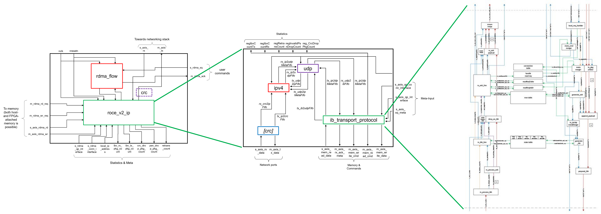

<article class="markdown-body entry-content p-3 p-md-6" itemprop="text">

<a href="https://github.com/fpgasystems/hacc-platform#--hardware-acceleration-platform">Back to top</a>

# Balboa

Balboa is a RDMA-stack for FPGAs which supports 100 Gbit networking and provides low latency and high throughput comparable to ASIC-based NICs. Since Balboa is completely compliant to the RoCE-v2 protocol, it allows RDMA-communication with any standard NIC and thus establishes the FPGA as a valid computing node in the network.

*Balboa’s architecture.*