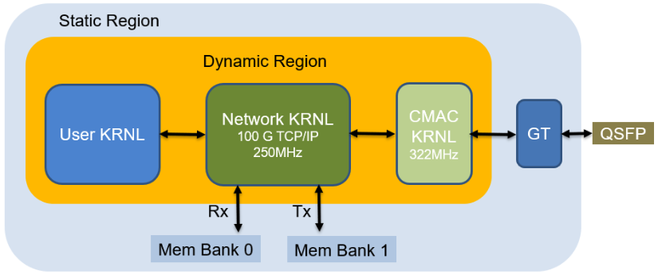

<article class="markdown-body entry-content p-3 p-md-6" itemprop="text">

<a href="https://github.com/fpgasystems/hacc-platform#--hardware-acceleration-platform">Back to top</a>

# FPGA Stack

Our FPGA stack integrates a 100 Gbps TCP/IP network stack into a state-of-the-art FPGA development framework. Additionally, it provides a rich set of high- performance communication primitives using HLS.

The following picture shows a high-level overview of the FPGA (network) stack:

*Architecture overview.*

**To get to know more about the FPGA Stack, please have a look to:**

* [fpga-network-stack](https://github.com/fpgasystems/fpga-network-stack)
* [Vitis_with_100Gbps_TCP-IP](https://github.com/fpgasystems/Vitis_with_100Gbps_TCP-IP)