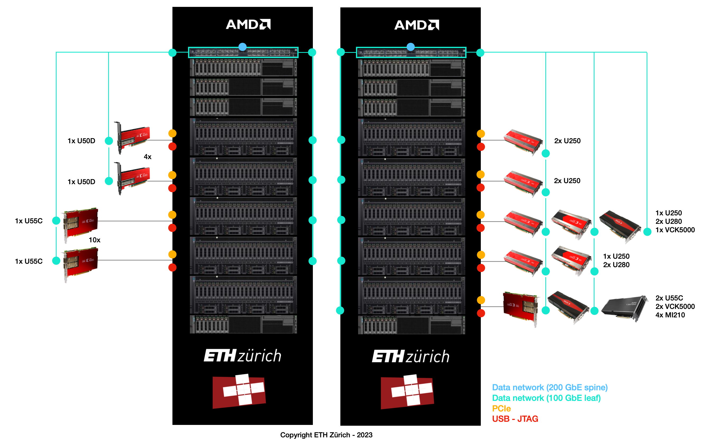

<article class="markdown-body entry-content p-3 p-md-6" itemprop="text">

<a href="https://github.com/fpgasystems/hacc-platform#--hardware-acceleration-platform">Back to top</a>

# HACC

As a multi-core CPU, GPU, and FPGA cluster, ETHZ’s Heterogeneous Accelerated Compute Cluster (ETHZ-​HACC) allows research in distributed systems, databases, cloud computing, and hardware acceleration of data science. Internally, we are using ETHZ-HACC as the grounds to offer our HACC Platform to all our cluster users.

*ETHZ-HACC is comprised of high-​end servers, reconfigurable accelerator cards, and high-​speed networking.*

**To get to know more about ETHZ-HACC, please have a look to:**

* [HACC’s GitHub repository](https://github.com/fpgasystems/hacc)
* [Heterogeneous Accelerated Compute Cluster - ETH Zürich](https://public.3.basecamp.com/p/nEfuexnX55Q1ys7gAUQLjEsN)