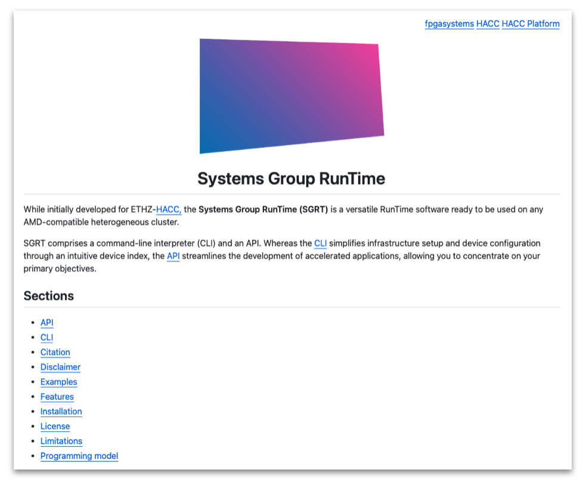

<article class="markdown-body entry-content p-3 p-md-6" itemprop="text">

<a href="https://github.com/fpgasystems/hacc-platform#--hardware-acceleration-platform">Back to top</a>

## Systems Group RunTime (SGRT)

All our advances are **open-source** and offered as a design platform through the Systems Group RunTime. With this initiative, we hope that ETHZ-HACC users will be able to develop their accelerated applications more quickly. To get to know more about SGRT, please have a look to its **[GitHub’s repository:](https://github.com/fpgasystems/sgrt)**

*SGRT’s GitHub repository.*